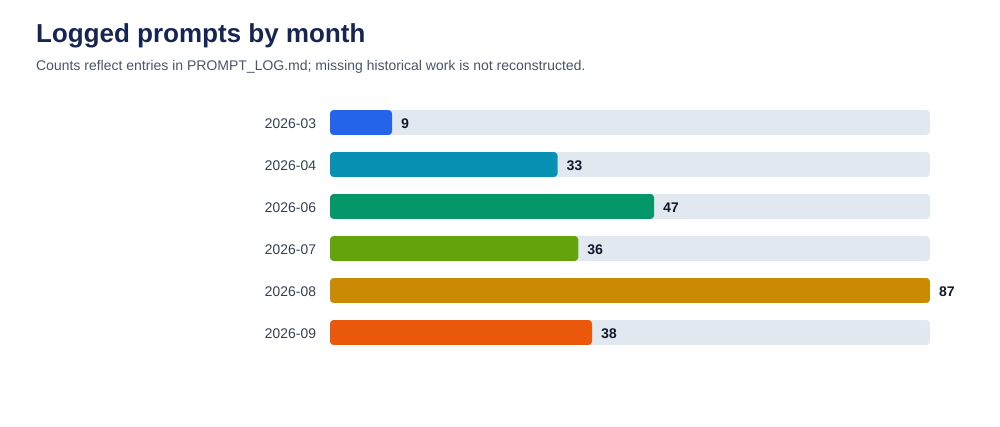
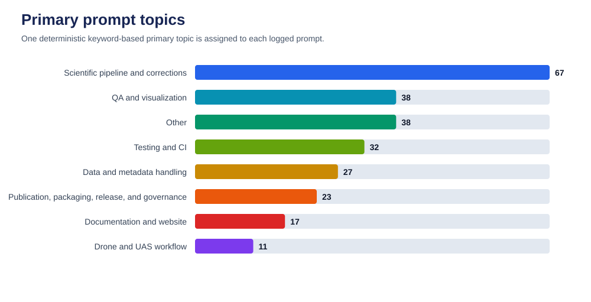
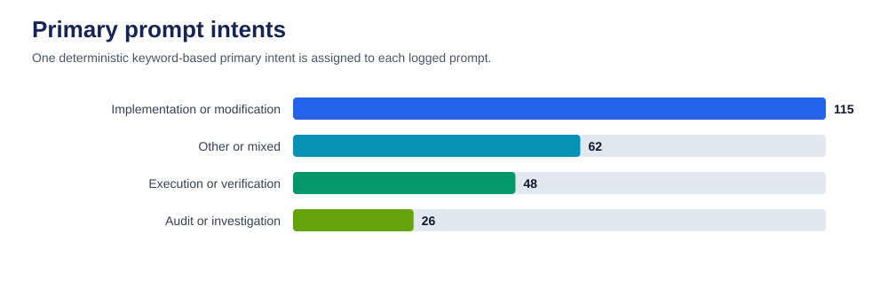
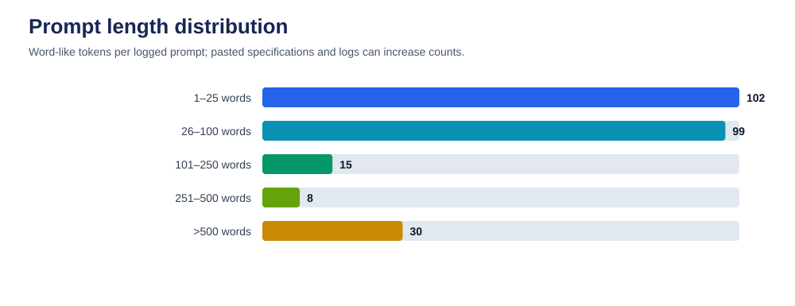

# AI Transparency Statement

> This page is generated from `PROMPT_LOG.md` by `scripts/generate_ai_transparency.py`. It reports the development requests recorded in the repository; it does not measure scientific validity or assign code authorship.

## Summary

From 2026-03-21 through 2026-09-04, the log contains **222 prompts** totaling **36,554 words**. The median prompt contains **32 words** and the mean contains **164.7 words**. Under the published keyword rules, the most common primary topic is **Scientific pipeline and corrections**, and the most common request intent is **Implementation or modification**.









## Which AI was used

The prompt log declares the AI system used for logged work. Model names are reported only when an entry records them; missing model metadata is not inferred.

| AI system | Logged prompts |
| --- | ---: |
| OpenAI Codex | 190 |
| Cursor Agent | 32 |

| Model metadata | Logged prompts |
| --- | ---: |
| Not recorded | 202 |
| GPT-5 | 13 |
| GPT-5 family (exact deployment identifier not exposed) | 7 |

Model metadata is recorded for **20 of 222 entries (9%)**.

## How AI was used

The logged requests cover implementation and modification, audits and investigations, verification, documentation, QA, pipeline behavior, and publication maintenance. Each entry receives one primary topic and one primary intent through deterministic keyword scoring over the prompt and its logged task label. These labels summarize requests, not completed work; consult Git history, tests, and review records for evidence of outcomes.

## Scope and limitations

- The source log begins after repository development was already underway, so it is not a complete history of AI use.
- It records user prompts, not assistant responses, accepted/rejected suggestions, token usage, elapsed time, or line-level authorship.
- Long prompts may contain pasted logs or specifications; word counts measure prompt text, not effort.
- Topic and intent labels are rule-based approximations based on prompt text and the logged task label. The rules are version-controlled in the generator.
- Legacy entries use the log-level AI-system default. Their model is `Not recorded` unless an entry explicitly provides model metadata.
- Prompts may contain sensitive material. The generated report includes aggregates only and does not reproduce prompt text.

## Reproduce this statement

```bash
python scripts/generate_ai_transparency.py
python scripts/generate_ai_transparency.py --check
```

Machine-readable statistics are available in [`ai-transparency.json`](ai-transparency.json). The source-log SHA-256 recorded there allows a reviewer to verify which prompt-log revision produced this page.
