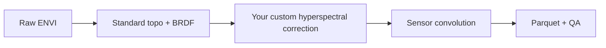

# Add a custom correction between pipeline stages

Use this pattern when you want to test an additional reflectance correction
after SpectralBridge's topographic and BRDF stage but before sensor convolution.
The supported pipeline remains unchanged; your experiment calls the same stage
functions explicitly and supplies a different corrected ENVI pair to the
convolution stage.

## Why this location is the safe hook

At this point the input has already been exported from NEON HDF5 and corrected
for the package's standard geometry assumptions, but it is still hyperspectral.
Applying an experimental correction before convolution lets the same corrected
spectrum feed Landsat, MicaSense, and other target responses.



Do not patch functions in the installed module at runtime. Call the stages in
order and pass explicit paths. Runtime monkeypatching makes provenance and
restart behavior difficult to audit.

## Use an isolated experiment folder

Sensor outputs have canonical names. If standard sensor products already exist
in the same flightline directory, restart logic may correctly reuse them even
though you intended to test a new source cube. Give each correction experiment
its own `base_folder` and keep the canonical `flight_stem` inside that folder.

Suggested layout:

```text
outputs/
├── baseline/
│   └── <flight_stem>/...
└── custom_scs_v1/
    ├── <flight_stem>.h5
    └── <flight_stem>/
        ├── <flight_stem>_envi.img/.hdr
        ├── <flight_stem>_brdfandtopo_corrected_envi.img/.hdr
        ├── <flight_stem>_brdfandtopo_custom_scs_v1_envi.img/.hdr
        └── <flight_stem>_custom_scs_v1_provenance.json
```

`custom_scs_v1` is an example slug. Use lowercase letters, numbers, and
underscores; include a method version when behavior may change.

## Stage-by-stage skeleton

```python
from pathlib import Path

from spectralbridge.pipelines.pipeline import (
    stage_apply_brdf_topo_correction,
    stage_build_and_write_correction_json,
    stage_convolve_all_sensors,
    stage_export_envi_from_h5,
)

base_folder = Path("outputs/custom_scs_v1")
flight_stem = "NEON_D13_NIWO_DP1_L019-1_20230815_directional_reflectance"
product_code = "DP1.30006.001"

raw_img, raw_hdr = stage_export_envi_from_h5(
    base_folder=base_folder,
    product_code=product_code,
    flight_stem=flight_stem,
)
parameters_json = stage_build_and_write_correction_json(
    base_folder=base_folder,
    product_code=product_code,
    flight_stem=flight_stem,
    raw_img_path=raw_img,
    raw_hdr_path=raw_hdr,
)
standard_img, standard_hdr = stage_apply_brdf_topo_correction(
    base_folder=base_folder,
    product_code=product_code,
    flight_stem=flight_stem,
    raw_img_path=raw_img,
    raw_hdr_path=raw_hdr,
    correction_json_path=parameters_json,
)

# Implement this in your analysis code. It must write both paths and preserve
# spatial shape, wavelength order, map information, NoData semantics, and scale.
custom_img = base_folder / flight_stem / f"{flight_stem}_brdfandtopo_custom_scs_v1_envi.img"
custom_hdr = custom_img.with_suffix(".hdr")
apply_custom_correction(
    input_img=standard_img,
    input_hdr=standard_hdr,
    output_img=custom_img,
    output_hdr=custom_hdr,
)

stage_convolve_all_sensors(
    base_folder=base_folder,
    product_code=product_code,
    flight_stem=flight_stem,
    corrected_img_path=custom_img,
    corrected_hdr_path=custom_hdr,
    resample_method="convolution",
    extraction_mode="full",
)
```

The stage imports are lower-level interfaces intended for controlled research
extensions. The standard user entry points remain `go_forth_and_multiply` and
`process_one_flightline`.

## Contract for `apply_custom_correction`

Your function should:

1. Read and write in chunks so a full cube is not loaded into memory.
2. Preserve line, sample, and band counts unless a new documented stage is
   intentionally responsible for changing them.
3. Preserve wavelength order, FWHM metadata, CRS/map information, NoData value,
   and reflectance scaling.
4. Write a new ENVI `.img/.hdr` pair; never overwrite the standard corrected
   pair.
5. Write a provenance JSON with method name/version, parameters, input hashes or
   paths, creation time, software version, and diagnostic summaries.
6. Fail before convolution if either output is missing or invalid.

## Minimum validation for a new correction

- **Identity test:** neutral parameters reproduce the input within declared
  numeric tolerance.
- **Controlled-change test:** a synthetic cube changes in the expected
  direction and only where intended.
- **NoData test:** invalid pixels remain invalid and do not contaminate valid
  neighbors.
- **Metadata test:** shape, wavelength/FWHM order, CRS, transform, and scale are
  unchanged.
- **Chunk test:** different chunk sizes produce equivalent results.
- **Restart test:** a valid completed custom output is reused; an incomplete pair
  is rejected.
- **Comparative QA:** produce baseline-versus-custom spectra, spatial deltas,
  correction magnitude by wavelength, and downstream Landsat-band differences.

Start from the downloadable
[custom-correction notebook](../vignettes/notebooks/08_custom_correction_hook.ipynb)
and keep the experiment separate until its assumptions and diagnostics have
been scientifically reviewed.

