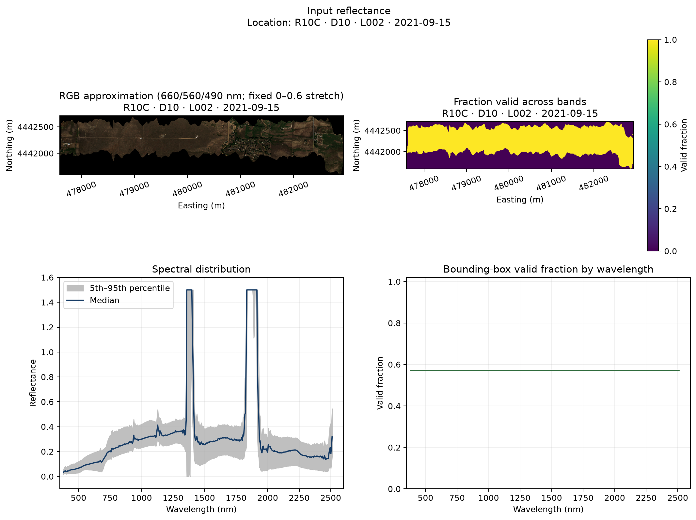
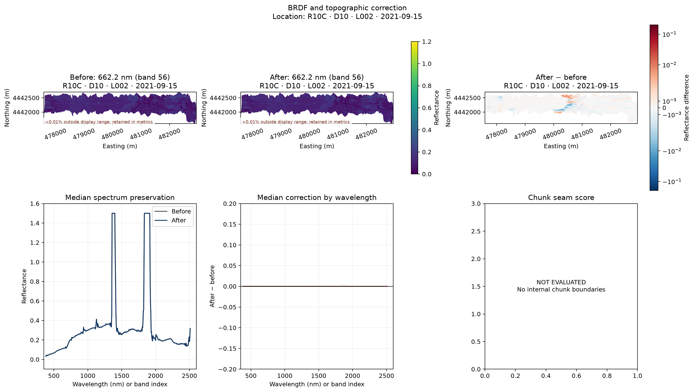
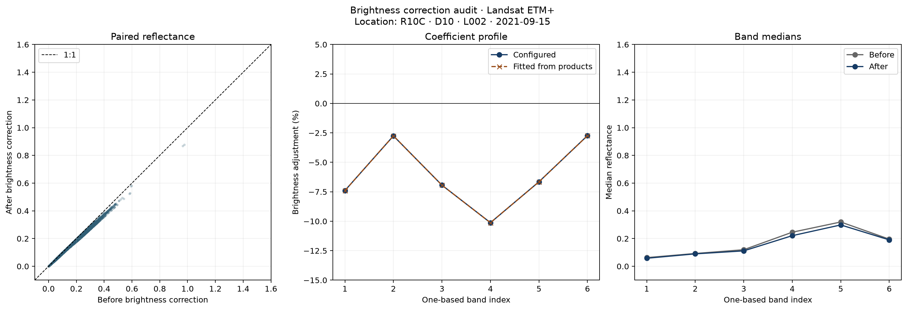
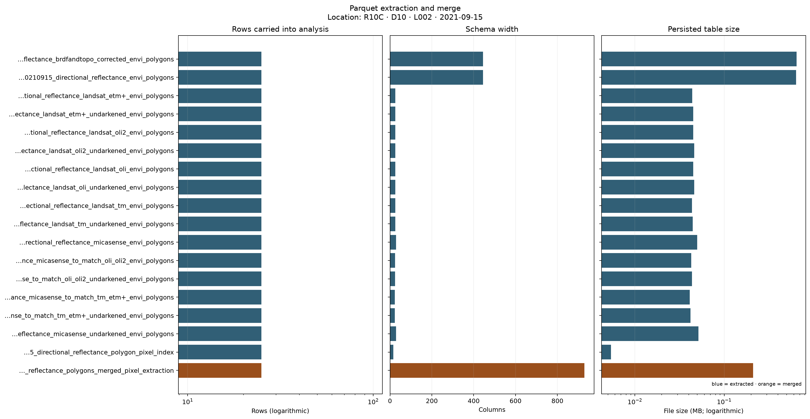

# Validation evidence

This section records how SpectralBridge functions behave across explicit input variations. Each row comes from a machine-readable campaign result rather than a hand-written success claim.

## How to use this section

Validation is presented in three connected layers:

1. **Module contract pages** explain the inputs varied, every Boolean check, every recorded diagnostic, and the limits of the evidence.
2. **[Stage QA test guide](stage-qa-guide.md)** explains the checks emitted by a completed pipeline in acquisition-to-table order.
3. **[Real flightline walkthrough](real-data-example.md)** interprets one 2.4 GB R10C run and links its complete HTML and JSON reports.

A green offline contract does not imply scientific validation. A real stage `WARN` does not imply a crash. Read the stated evidence boundary on each page before comparing statuses.

## Current evidence

| Module | Variations | Passed | Failed | Skipped | Detailed test guide | Real stage QA |
| --- | ---: | ---: | ---: | ---: | --- | --- |
| NEON HDF5 download | 5 | 5 | 0 | 0 | [Inputs, checks, and results](neon_download.md) | [Matching stage](stage-qa-guide.md#acquisition) |
| HDF5 to raw ENVI | 5 | 5 | 0 | 0 | [Inputs, checks, and results](h5_to_envi.md) | [Matching stage](stage-qa-guide.md#input-reflectance) |
| Topographic correction | 5 | 5 | 0 | 0 | [Inputs, checks, and results](topographic_correction.md) | [Matching stage](stage-qa-guide.md#brdf-and-topographic-correction) |
| BRDF correction | 5 | 5 | 0 | 0 | [Inputs, checks, and results](brdf_correction.md) | [Matching stage](stage-qa-guide.md#correction-parameters) |
| Sensor convolution | 5 | 5 | 0 | 0 | [Inputs, checks, and results](sensor_convolution.md) | [Matching stage](stage-qa-guide.md#spectral-convolution-and-brightness) |
| Parquet extraction and CSV conversion | 5 | 5 | 0 | 0 | [Inputs, checks, and results](parquet_csv.md) | [Matching stage](stage-qa-guide.md#parquet-extraction-and-merge) |
| Save and restart behavior | 5 | 5 | 0 | 0 | [Inputs, checks, and results](save_restart.md) | [Matching stage](stage-qa-guide.md#acquisition) |
| QA plots and diagnostics | 5 | 5 | 0 | 0 | [Inputs, checks, and results](qa_plots.md) | [Matching stage](stage-qa-guide.md) |

## Two validation tiers

1. **Tier A — installed-artifact CI smoke:** the exact built wheel is installed outside the checkout and runs every major normal, drone, and bulk stage on tiny deterministic fixtures. It checks package resources, orchestration, schemas, output readability, bounded resource use, and restart behavior.
2. **Tier B — production validation:** opt-in real data selected from a pinned inventory runs on an appropriately sized machine. It measures full-scale operational behavior, correction support, performance, and QA usefulness across sites and acquisition conditions.

These tiers must remain separate. Scale reduction in Tier A is acceptable only
because it executes the same production algorithms and code paths. Repeating
synthetic inputs can expose packaging, numerical, and state bugs, but it cannot
establish scientific accuracy on real landscapes, production-scale
performance, cross-site stability, or empirical calibration validity. See the
[production validation record](../dev/production-validation-record.md) for the
release evidence contract.

## Example figures from the real test run

The figures below are generated artifacts from R10C · D10 · L002 · 2021-09-15. Their axes and map scales follow plot-contract version 1.1 so later runs can be compared directly.

  <figure class="sb-validation-figure">
    
    <figcaption>The real exported ENVI is reviewed spatially and spectrally after scale and NoData metadata are applied.</figcaption>
  </figure>
  <figure class="sb-validation-figure">
    
    <figcaption>Matched maps and spectra show the combined persisted BRDF/topographic result; the pipeline does not store a topo-only intermediate.</figcaption>
  </figure>
  <figure class="sb-validation-figure">
    
    <figcaption>Configured and fitted brightness adjustments overlap; this verifies application, not scientific optimality of the coefficients.</figcaption>
  </figure>
  <figure class="sb-validation-figure">
    
    <figcaption>The real run compares rows, schema width, and file size for 18 readable extracted and merged tables.</figcaption>
  </figure>

## Recorded campaigns

| Campaign | Mode | Revision | Dirty tree | Generated (UTC) | Total | Passed | Failed |
| --- | --- | --- | --- | --- | ---: | ---: | ---: |
| `offline-contract-5-per-module` | offline | `bebf707` | true | 2026-08-14T18:05:29.385201+00:00 | 40 | 40 | 0 |

## Interpretation rules

- A **pass** means every explicit software-contract check for that variation passed.
- A **failure** remains visible and includes its diagnostics or exception.
- A **skip** must state why evidence was not collected.
- Synthetic checks must not be described as external scientific validation.
- QA thresholds should be changed only after a representative real-data campaign and scientific review.

The underlying JSON records live in `validation/results/` and are the source of truth for these pages.

Last updated: 2026-08-14
