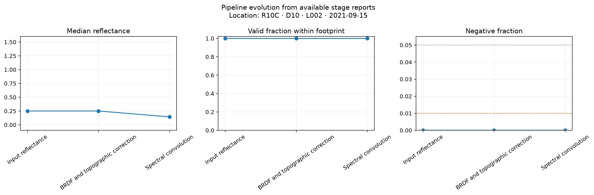

# Real flightline QA walkthrough

This is a transparent record of one end-to-end real-data validation run. It is
evidence that the software stages and QA reporting work together on a large
NEON file; it is **not** a claim that one flightline validates the scientific
method across sites, seasons, terrain, or land-cover classes.

## Input and run scope

| Item | Value |
| --- | --- |
| Source | `NEON_D10_R10C_DP1_L002-1_20210915_directional_reflectance.h5` |
| Source size | 2,532,249,598 bytes (2.4 GB) |
| Site/date | R10C, 2021-09-15 |
| Raster dimensions | 1,115 lines × 5,351 samples × 426 bands |
| QA mode | `deep` |
| Extraction | A bounded 4 × 4-pixel validation polygon |
| Merged output | 25 rows × 929 columns, including 484 spectral columns |
| Table products | 18 readable Parquet files |

The source HDF5 remains local and is ignored by Git. The approximately 21 GB of
intermediate raster and table products were intentionally not added to the
repository. Only the approximately 4.6 MB report bundle is retained here.

NEON's product guidance says stored reflectance is scaled by 10,000 and missing
pixels use `-9999`. SpectralBridge now persists both facts in each ENVI header
and stage QA converts metrics to unit reflectance before evaluation. See the
[official NEON quick-start guide](https://data.neonscience.org/api/v0/documents/quick-start-guides/NEON.QSG.DP1.30006.001v2?fallback=html&inline=true).

## What happened

| Stage | Status | Main evidence |
| --- | --- | --- |
| Acquisition | PASS | The expected 2.4 GB HDF5 existed and received a bounded provenance fingerprint. |
| Input reflectance | WARN | The flight footprint occupies 0.5713 of the rectangular raster, but valid support within the footprint is 1.0. All-band values above 1.2 remain visible at 0.05932; 68 known poor-quality bands are retained and labeled. |
| Correction parameters | WARN | Required model artifacts and all six geometry fields were present, but four persisted geometry summaries contain values outside their physical radian ranges. They remain visible and unmasked for review. |
| BRDF + topographic correction | WARN | The same 68 poor-quality wavelength bands remain retained and labeled; correction magnitude passed with absolute difference q99 of 0.003894. |
| Spectral convolution | PASS | Within-footprint support was 1.0, negative fraction was 0, and the all-band fraction above 1.2 was 0.0000143. |
| Analysis tables | PASS | All 18 declared Parquet products were readable; merged output had 25 rows and 929 columns. |

`WARN` marks information that needs interpretation; it does not mean the
pipeline crashed. The full process exited normally and created the correction,
convolution, extraction, merge, and QA artifacts.

The correction-parameter warning is specifically about the persisted summary,
not a claim that every corrected pixel is invalid. `sensor_zn`, `sensor_az`,
`slope`, and `aspect` include large negative summary values consistent with
source no-data contamination. QA now marks all four fields, plots the unfiltered
summaries against fixed physical ranges, and leaves the correction files
unchanged. A later pipeline change can decide where no-data should be excluded;
this audit does not silently make that scientific choice.

The original all-array valid fraction of 0.5713 is still present in the JSON for
transparency. QA now interprets it as bounding-box occupancy: all 426 bands had
valid values at every sampled pixel inside the observed footprint, for a
within-footprint valid fraction of 1.0. The 42.87% structural background remains
in the files as no-data and is neither cropped nor masked by QA.

The original all-band fraction above 1.2 is also retained: 0.059315 before
correction and 0.059317 after correction. QA labels 68 of 426 wavelengths using
the long-standing repository ranges 300–400, 1337–1430, 1800–1960, and
2450–2600 nm. Within those retained bands, 0.3715 of valid sampled values exceed
1.2; over the other 358 wavelengths, the fraction is only `1.418e-05` before
correction. This is report-only classification: no band, pixel, or stored value
was removed, replaced, or rewritten. The correction comparison was otherwise
close: bias `1.88e-05`, MAE `0.000233`, RMSE `0.000942`, slope `1.00003`, and R²
`0.999991` on the deterministic sample.

The regenerated figures use QA plot-contract version 1.1. Their physical axes
and color scales are fixed for comparison with later flightlines, and each
figure identifies `R10C · D10 · L002 · 2021-09-15` within the image. Spatial
panels use the ENVI map metadata to show UTM easting and northing. Display-range
clipping is annotated and never removes values from the metrics or products.
Every canonical stage now has at least one figure. Acquisition shows the source
artifact inventory; correction parameters show BRDF coefficient profiles and
the unfiltered persisted geometry summaries; convolution adds one paired
brightness-correction audit per Landsat product; and analysis tables compare
row count, schema width, and file size for extracted and merged Parquet outputs.

## Reports and reproducibility artifacts

- [Read the stage-by-stage test guide](stage-qa-guide.md)
- [Open the combined HTML report](artifacts/r10c-l002-20210915/qa/combined/combined_qa.html)
- [Download the combined JSON report](artifacts/r10c-l002-20210915/qa/combined/combined_qa.json)
- [Open the input-data stage report](artifacts/r10c-l002-20210915/qa/stages/01_input_data/stage_qa.html)
- [Open the correction stage report](artifacts/r10c-l002-20210915/qa/stages/03_brdf_topographic_correction/stage_qa.html)
- [Open the convolution stage report](artifacts/r10c-l002-20210915/qa/stages/04_spectral_convolution/stage_qa.html)
- [Open the analysis-table stage report](artifacts/r10c-l002-20210915/qa/stages/05_analysis_tables/stage_qa.html)
- [Open the legacy QA panel](artifacts/r10c-l002-20210915/legacy-qa.png)
- [Download the legacy QA PDF](artifacts/r10c-l002-20210915/legacy-qa.pdf)

The JSON reports include the package version, Git revision, parameters,
deterministic sampling record, artifact fingerprints, checks, thresholds, and
explicit reasons for unevaluated diagnostics. Absolute paths in that record are
the execution environment's provenance paths; they are not required to open
the copied reports.

## What this run could not evaluate

- Topographic-only versus BRDF-only attribution, because the canonical pipeline
  deliberately persists their combined corrected output rather than a
  topographic-only intermediate.
- A second application using a genuinely different correction chunking scheme;
  no independent application-chunk control is currently part of the contract.
- Per-output-band SRF support, because the convolved artifact does not yet
  persist its exact spectral-response weights.
- Sensor-triangle path/cycle consistency and held-out translation residuals,
  because a NEON processing run does not create fitted translation edges or
  independent paired observations.
- Direct Landsat Collection 2 NBAR comparability, which belongs to the separate
  Landsat acquisition and translation validation workflow.

These limitations remain `NOT EVALUATED` in the reports rather than being
silently omitted or replaced with synthetic evidence.

## Bugs revealed by the real run

The first pass found four output-contract problems that the new regression
tests now protect:

1. Raw and corrected ENVI headers did not serialize reflectance scale and
   no-data values for downstream readers.
2. Landsat brightness adjustment transformed no-data sentinels as though they
   were reflectance.
3. Polygon-mode stage QA did not discover all Parquet products even though the
   pipeline had written them.
4. The compatibility QA panel treated stored reflectance counts and no-data as
   physical reflectance and used a count-scale wavelength axis. It now reads the
   persisted scale/no-data contract and displays physical reflectance.

It also exposed a harmless NumPy warning caused by eager division while choosing
a neutral BRDF factor for non-positive kernels. The guarded division now avoids
the warning without changing the correction rule or scientific result.
